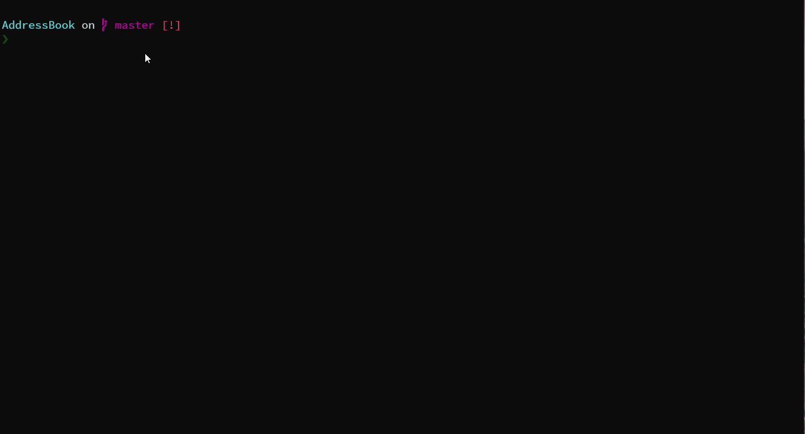

# AddressBook

用于记录联系方式的小工具，支持 ``CLI`` 和 ``TUI`` 。  


🌎 [English](README.md) | 中文

## 💻运行


## ✨ 功能

1. 添加联系方式
2. 修改联系方式
3. 删除联系方式
4. 查找联系方式（姓名查找，地址查找，号码查找）
5. 分享联系人卡片
6. 重置通讯录
7. 支持CLI 操作方式
8. 设计自己的主题
9. 添加语言包

## ⚙️ 如何设计自己的主题?

1. 你需要先创一个 ``theme.txt`` 文件。
2. 把他放到 ``AddressBook`` 文件夹中。
3. 接着你就可以开始设计自己的主题了。  
   下面是一些配置设置：  

   **配置显示框标签**
   - 你必须把 ``windowstag`` 放在以下配置项前面。
   - ``rightUpTag``, ``leftUpTag``, ``rightDownTag``, ``leftDownTag``, ``upAndDownTag``, ``leftAndRightTag``, ``tittleLeftTag`` and ``tittlrRightTag`` 这些是标签样式配置。
   - ``rightUpColor``, ``leftUpColor``, ``rightDownColor``, ``leftDownColor``, ``upAndDownColor``, ``leftAndRightColor``, ``tittleLeftColor`` and ``tittlrRightColor`` 这些是标签颜色配置。  

   **配置窗口信息**
   - 你必须把 ``windowsInfo`` 放在以下配置项前面。
   - ``logoElementX``, ``fliterElementX`` and ``indexElementX`` 这些是元素的位置信息配置.
   - ``logoElementColor``, ``fliterElementColor``, ``indexElementColor``, ``guideElementColor``, ``foucerColor``, ``unforceColor``, and ``versionColor`` 这些是标签颜色配置。  

**📝 例如 >>> [theme.txt](theme.txt)**
```
windowsTag
    rightUpTag:╮
    rightDownTag:╯
    leftUpTag:╭
    leftDownTag:╰
    upAndDownTag:─
    leftAndRightTag:│
    titleLeftTag:<
    titleRightTag:>
    rightUpColor:(0,255,255)
    rightDownColor:(0,255,255)
    leftUpColor:(0,255,255)
    leftDownColor:(0,255,255)
    upAndDownColor:(0,255,255)
    leftAndRightColor:(0,255,255)
    titleLeftColor:(255,0,0)
    titleRightColor:(255,0,0)

windowsInfo
    logoElementX:3
    fliterElementX:17
    logoElementColor:(165,42,42)
    fliterElementColor:(165,42,42)
    indexElementColor:(0,255,255)
    fouceColor:(255,0,0)
    unfouceColor:(244,164,96)

```
## 🤝 参与共建
欢迎 FORK 和 PR 以及各种 issue。